# Chief of Staff

A renewal-operations workspace for a commercial property & casualty insurance book.

A commercial insurance renewal is a 270 day project that repeats every year, per
client, per line of coverage. Most of the operational work is document logistics: collect exposure
data, request loss runs from every incumbent carrier, assemble a submission, compare
quotes, bind, invoice, chase policies. The tracking for it usually lives in a spreadsheet
that goes stale every other day, filed away in a crowded Outlook folder, or worse - in your head.
At best, status is whatever somebody last remembered to type, save, and share with the team.

This replaces that with an AI-native pipeline: read mail and calendar, infer which stage each
renewal is in, derive status from evidence rather than self-report, and attach tools to
the tasks that involve reading or writing documents.

The sections below walk through the app as you would actually use it: the dashboard,
then the skills that do real document work. All examples are made using fictional clients
and fictional data.

1. **[The welcome dashboard](#1-the-welcome-dashboard)**: sign in & understand exactly where each client stands - in a matter of seconds
2. **[The loss run request](#2-the-loss-run-request)**: read a stack of binders, extract necessary fields, & produce one email per carrier
3. **[The invoicing assistant](#3-the-invoicing-assistant)**: reconcile premium, commission, taxes and fees
4. **[The RSM deck builder](#4-the-rsm-deck-builder)**: roll last year's strategy deck forward

---

## 1. The welcome dashboard

Everything starts on one screen: what is in your book, where each account sits, and what
is due next.

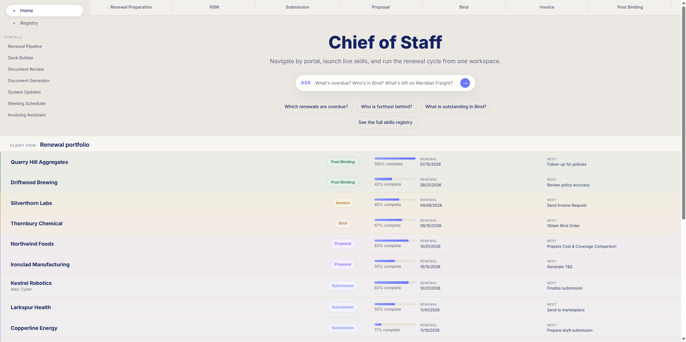

Three things on this page:

**The stage tabs.** Across the top are the seven stages every renewal moves through, in
order:

| Stage | Window | What happens |
|---|---|---|
| Renewal Preparation | 180–120 days | Open the file, confirm the team, request loss runs and exposures |
| RSM | 180–90 days | Build the strategy, meet the client, & agree on this years approach to the program |
| Submission | 90–60 days | Applications, submission package, & marketing efforts |
| Proposal | 60–15 days | Log quotes, compare against expiring, negotiate, & present |
| Bind | 15–0 days | Bind instructions, bind orders, check binders, & transmittal |
| Invoice | 0–5 days | Confirm bound figures, allocate premium, & invoice |
| Post Binding | 0–60 days | Close subjectivities, issue certificates, check and deliver policies |

Each tab opens that stage's task list and the accounts currently sitting in it. A
client's stage is derived based on email activity — it is the last stage whose date has passed,
and it can be overridden per account when reality disagrees with the derivation.

The left rail is the same work vertically: Renewal Pipeline, Deck
Builder, Document Review, Document Generator, System Updates, Meeting Scheduler,
Invoicing Assistant. The stage helps the user track *when*; the portal assists in completing repetitive tasks.

### The renewal portfolio

At the bottom of the welcome page, the user can see their whole book on one screen, ordered by renewal date.

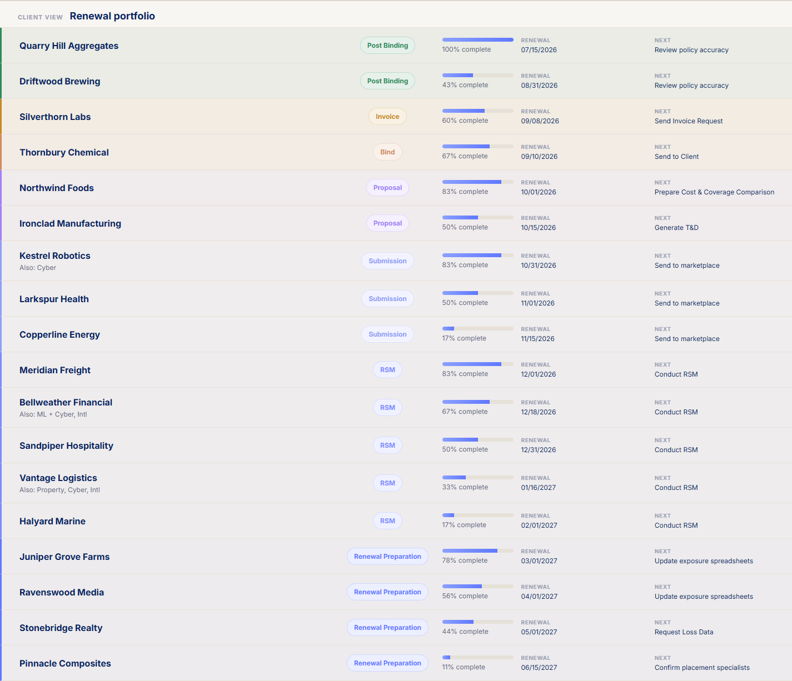

Each row carries the stage, how far through that stage's task list the account is, the
renewal date, and the single next thing to do. Accounts running more than one program
show it under the name — Bellweather Financial carries *ML + Cyber* and *Intl* alongside
its P&C track, on separate renewal dates.

Progress is a real count, not a status someone set: it is the share of that stage's
tasks marked complete, and tasks complete in order, so the outstanding work is always
the tail of the list.

### The assistant

The chat bubble allows the user to perform Q&A against their book.

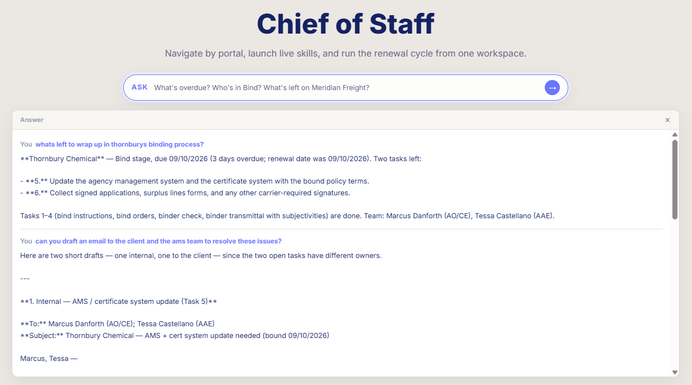

Asking *"what's left to wrap up in Thornbury's binding process?"* returns the stage, that
it is three days past its 09/10/2026 due date, the two specific tasks still open, and a
note that tasks 1–4 are already done, because it is reading the same task state the
portfolio counts.

**Follow-ups build on what came before.** The second questionL *"can you draft an email
to the client and the AMS team to resolve these issues?"* — never names Thornbury. It
does not need to. The conversation is carried forward, so "these issues" resolves to the
two open tasks from the previous answer, and the assistant splits the work by owner: the
AMS and certificate system update belongs to the internal team, the signature package
belongs to the client.

<table>
<tr>
<td width="50%">

**Internal — task 5**

Addressed to the two colleagues actually named on the account, asking for the agency
management system and certificate system to be updated with the bound terms so the file
can move to Invoice without a gap in certificate issuance.

</td>
<td width="50%">

**Client — task 6**

Addressed to the insured, listing exactly the signatures outstanding — signed
applications, surplus lines forms, remaining carrier-required signatures — and why they
matter before invoicing.

</td>
</tr>
<tr>
<td width="50%">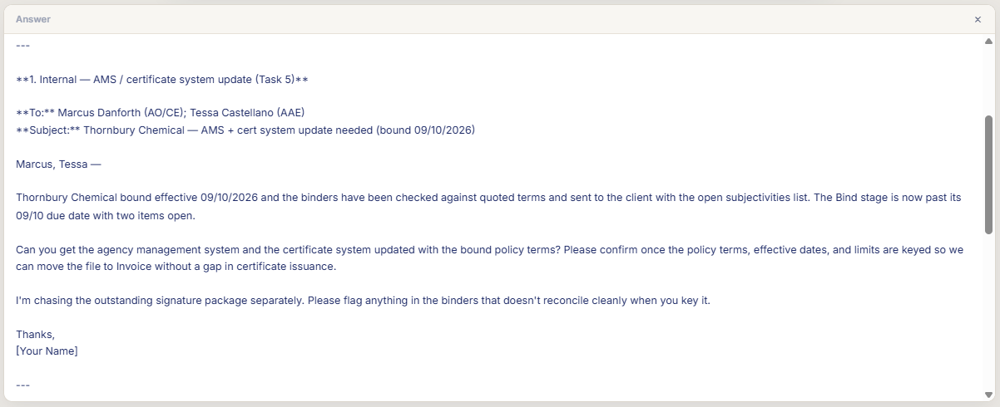</td>
<td width="50%">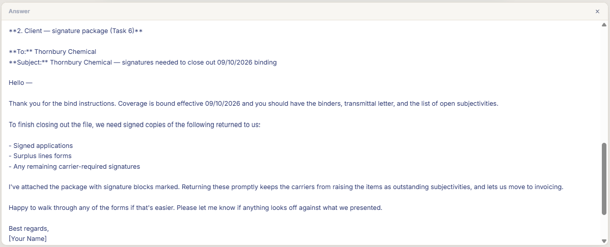</td>
</tr>
</table>

Both drafts are specific because the model is not guessing: the dates, task numbers,
colleague names and open items all come from the book passed with every request. That
book sits behind a prompt-cache breakpoint, so a long conversation costs the turns
themselves rather than re-reading the whole portfolio each time.

The assistant is optional. Without a `LLM_API_KEY` the rest of the app runs
exactly as it does here; the bar simply says how to configure one.

---

## 2. The loss run request

Every renewal starts by asking each incumbent carrier for the last 5-10 years of claims
history. On a program of any size that means opening anywhere from half a dozen to 30+ binders, copying policy
numbers, effective dates, issuing company, & line of coverage out of each one, working out which carrier services loss
runs for which paper, and writing the same email over and over.

This turns that into three steps using a human-in-the-loop model.

### Drop the binders in

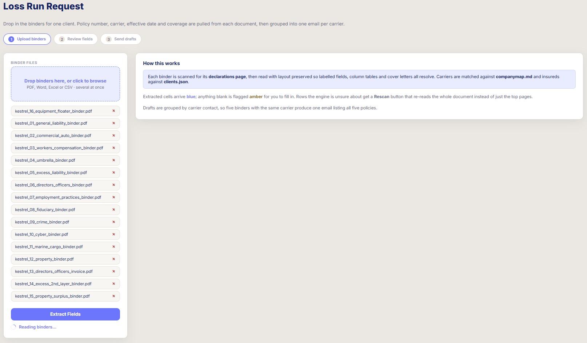

One client's binders go in together — PDF, Word, Excel or CSV. There is no per-carrier
template to pick and no form to fill in first; the documents are the input.

Each file is scanned for its declarations page and read with layout preserved, so a
label keeps the number that sits beside it rather than the next number in the text
stream. That matters because binders are laid out, not written: a policy number can sit
in a column, a table cell, or a cover letter paragraph, and all three have to resolve to
the same field.

### Check what it read

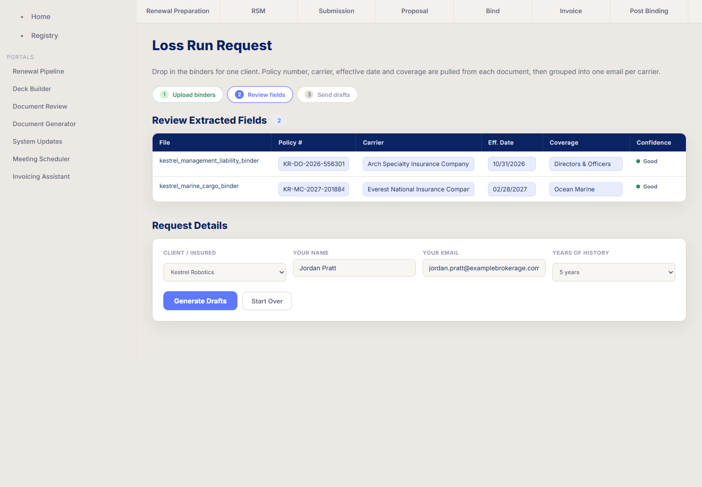

Four fields come back per document: policy number, carrier, effective date and coverage - with a confidence flag on each row. Extracted cells arrive blue; anything blank is
flagged amber to fill in. A row the engine is unsure about gets a **Rescan** button that
re-reads the whole document rather than just the pages it ranked highest.

Two resolutions happen here:

**The insured is matched against the client book.** Fifteen documents that say *Kestrel
Robotics Inc* on their face come back as the account *Kestrel Robotics*, so the request
is grouped under one client rather than several spellings of one.

**The carrier is matched to its group, not its paper.** *Hartford Fire Insurance
Company*, *Twin City Fire Insurance Company* and *Continental Casualty Company* are
entity names on binders; they resolve to **Hartford**, **Hartford** and **CNA** through a
341-group carrier map. This is the part that makes grouping possible at all — loss runs
are serviced by the group, not by whichever subsidiary issued the paper.

The two excess layers in this set resolve to **Berkshire Hathaway** and **Markel** 
(the carriers actually on the risk) rather than to the umbrella markets named in their underlying schedules.

### Send the drafts

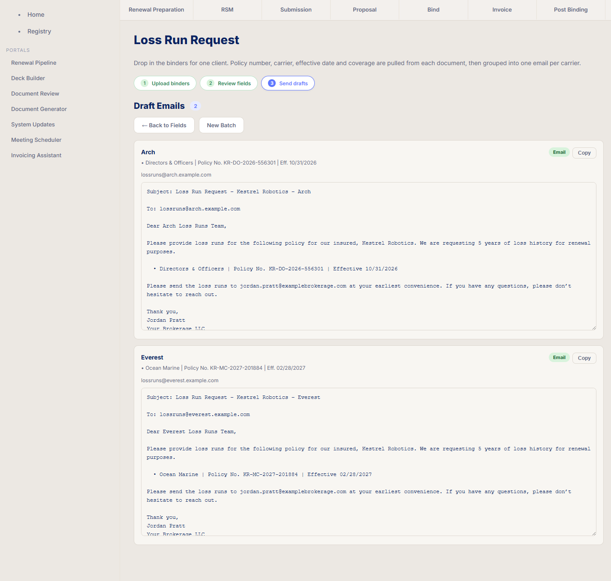

Fifteen binders across nine carriers become **nine emails, not fifteen**. Each one lists
every policy that carrier writes for the client, with coverage, policy number and
effective date on its own line. Hartford's draft carries four policies, CNA's carries
three.

The recipient is resolved from a routing map of 235 carrier loss-run mailboxes,
so the draft arrives addressed rather than blank. Where a carrier has no mailbox on file
the draft is still written and simply says so. Each draft is editable in place and copies to the clipboard.

### Under the hood

The reading is done by [`engine/loss_run.py`](engine/loss_run.py) — about 2,700 lines
that the loss run request, the invoicing assistant and the eval harness all share. Three
ideas do most of the work.

**Find the page before reading it.** A standard binder can be anywhere from 2 to 60 pages - 
declarations page is only one of them. Pages are ranked on a cheap text pass first, and only
the winners are re-read in layout mode, which is the expensive operation. This keeps a fifteen-document batch quick.

**The label vocabulary is ordered, and the order is the design.** Each field has a list
of patterns tried most-specific first, first match wins. `Net of commission` has to be
tested before both `commission` and `total`, because the label contains the words for
each. Get that order wrong and every net-of-commission binder reports the wrong figure.
The same applies to `Policy Symbol and Number` ahead of `Policy No.`, and to
`First Named Insured` ahead of `Insured`.

**A label near the wrong words belongs to a different policy.** `Underlying`,
`expiring`, `excess of`, `followed`, `renewal of` — each of these turns the value
beside a label into somebody else's policy. The engine suppresses matches in that
context, which is why the two excess binders resolve to the carriers actually on the
risk rather than to the umbrella markets named a few lines below them in their
underlying schedules.

Everything above resolves against two committed reference files rather than hard-coded
lists: [`docs/Skills/companymap.md`](docs/Skills/companymap.md) for carrier groups and
their paper, and [`docs/Skills/coverages.md`](docs/Skills/coverages.md) for coverage
categories.

---

## 3. The invoicing assistant

Same shape as the loss run request: one client's binders in & a reviewable table out.
This job is a little different. The loss run skill pulls *fields*. This one pulls *numbers
that have to add up*.

A bound program arrives as a stack of binders, each printing a premium, a commission,
and some mix of taxes, fees and surcharges that varies by state, by line, and by whether
the paper is admitted. Someone has to key every figure into an invoice request and be
right, and nobody can eyeball whether fifteen binders' line items reconcile.

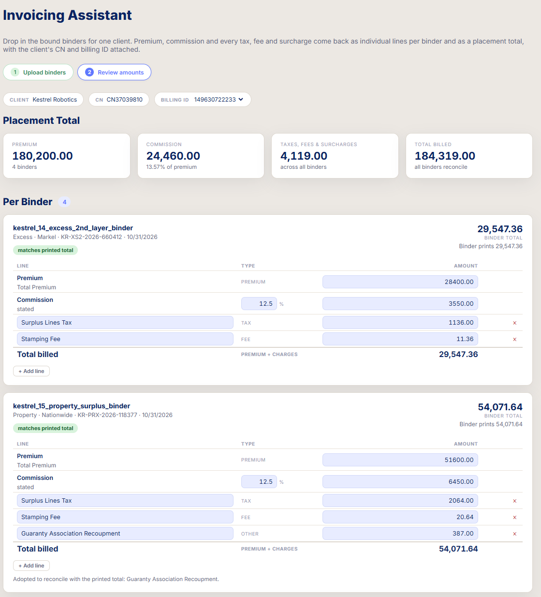

Every charge comes back as its own editable line: premium, commission, tax, fee,
surcharge, terrorism. Each binder is checked against the total printed. `Matches printed total` means the extracted lines sum to the carrier's own figure.
That check is the point: it catches a missed fee rather than quietly under-billing.

Three cases it has to survive, all visible above:

- **Non-admitted paper carries different charges.** The two E&S binders here show a
  surplus lines tax and a stamping fee; the admitted ones never do. What appears instead
  on admitted business is separately stated terrorism premium and state assessments.
- **Some carriers print only what the broker remits.** A binder stating a
  net-of-commission figure and no gross total reconciles against premium less commission
  instead.
- **A charge the vocabulary has never seen is still recoverable.** *Guaranty Association
  Recoupment* is not in any label list. It is identified by the 387.00 hole it leaves
  against the printed total, adopted, and labelled as such in the note under the binder.

### The output

<table>
<tr>
<td width="50%">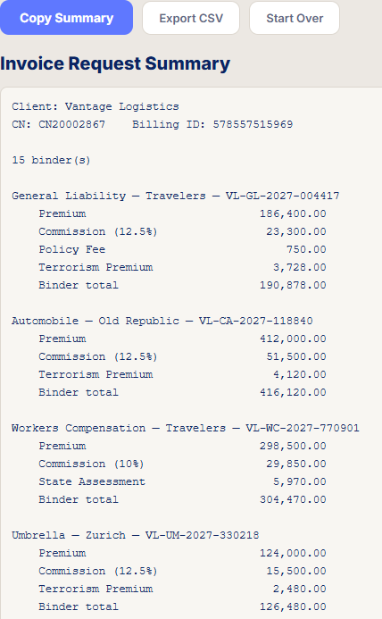</td>
<td width="50%">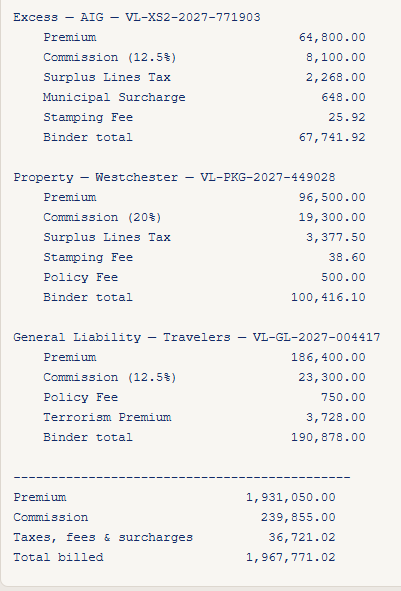</td>
</tr>
</table>

This is all summarized after clicking *Copy Fields*: the client's CN and billing ID from the book,  every
binder with its premium, commission and charges itemised, & the placement total.
Fifteen binders, 1,931,050.00 of premium, 36,721.02 of taxes, fees and surcharges,
1,967,771.02 billed, reconciled per binder before it is summed. It copies as text or
exports as CSV, and every cell is editable first.

The insured, carrier, policy number, dates comes from the same extraction
engine as the loss run request, [`engine/loss_run.py`](engine/loss_run.py). Only the
money parsing is new here.

---

## 4. The RSM deck builder

The first two skills read documents. This one writes one.

Before the renewal strategy meeting, last year's deck gets rebuilt: same narrative, new
policy year, current market conditions bolted on. Done by hand it is an hour of
tedious copying & pasting across PowerPoint files.

### Upload and configure

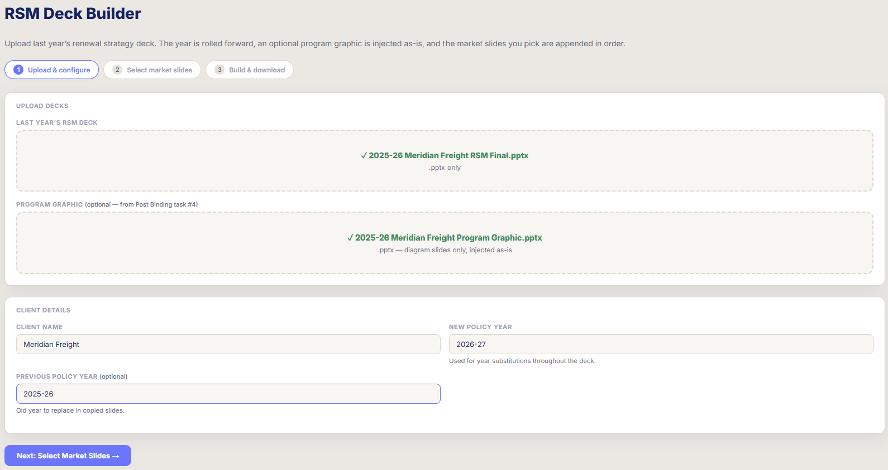

Last year's deck goes in, plus the program graphic if there is one. The old and new
policy years are stated explicitly - *2025-26* to *2026-27* - because the year appears
throughout the deck and every instance has to move together.

The program graphic is handled differently from everything else: it is injected **as-is**.
It is a diagram someone laid out by hand, and the one useful thing to do with it is not
touch it.

### Pick the market slides

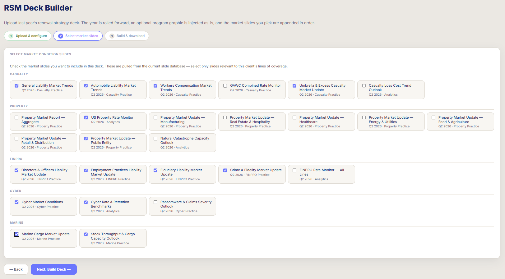

Instead of chasing team members or looking in messy libraries for updated slides, this step pulls from slides filed by line and by quarter.
You check the ones that you want in the deck.

The point is that the library is current and the deck is not. Rolling last year's file
forward keeps the client narrative; picking from the library replaces the market view
without rebuilding either.

### Build and download

The assembled deck comes back as `RSM_<client>_<year>.pptx`, with a slide-by-slide log
of what was copied and how each slide was classified: diagram, content, market, &
divider, so a deck that comes out wrong can be traced to the slide that caused
it rather than rebuilt from scratch.

### Under the hood

[`engine/rsm.py`](engine/rsm.py) assembles the deck at the ZIP level rather than through
python-pptx's object model, and the docstring at the top of that file explains why at
length. In short: there is no correct cross-presentation slide copy API. Every route
through the Part model fails in one of three ways: duplicate slide part URIs, aliasing
that drags the source's transitive relationships along with the slide, or lost
`customXml` that lives outside `ppt/` and is unreachable from the slide part.

It works on the bytes. Each slide's XML and its `.rels` are read, every referenced
part is renamed to avoid collisions, images, charts, notes and embeddings are copied
under the new names, the relationship IDs are rewritten to match, and the slide is
registered in `[Content_Types].xml` and `presentation.xml`.

ALthough its more complex than calling a library function; It's the difference between a
deck that opens and a deck that opens with a repair prompt.

---

## Architecture

Three diagrams cover most of it: how a request reaches the engine, what the engine does
to a document, and how configuration resolves.

### Layers

The Flask app owns routing and state. The skills are thin. The engine holds the hard
parts and imports no Flask, which is what lets the eval harness call it directly.

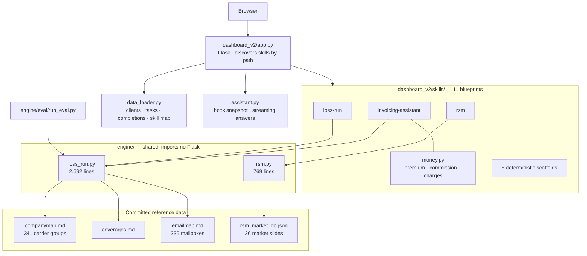

Only three of the eleven skills reach the engine. The other eight generate correct
checklists and draft text deterministically — `dashboard_v2/README.md` marks which is
which.

### What happens to a document

Both document skills share the front half of this path. They diverge once the fields are
out: the loss run request groups by carrier, the invoicing assistant keeps reading for
money.

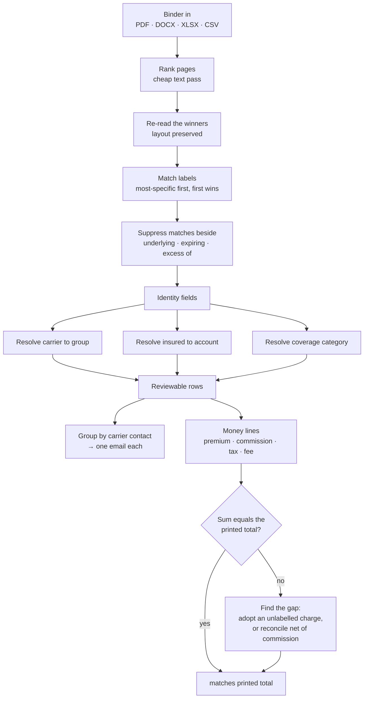

### How configuration resolves

Anything that would hold a real book is gitignored. Every one of those files has a
committed synthetic twin, and the loader falls back to it — which is why a fresh clone
renders a populated dashboard instead of an empty one.

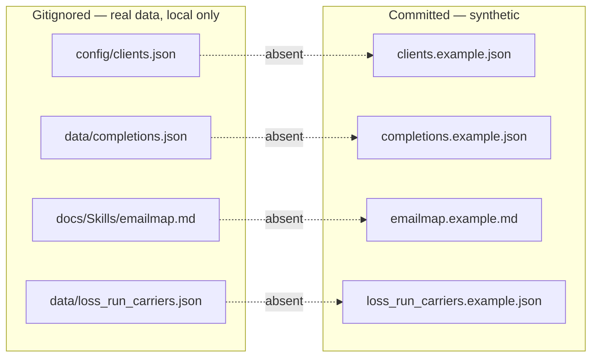

---

## Setup

Requires Python 3.12+. The `src/` pipeline additionally requires Windows with a desktop
Outlook profile, since it uses COM rather than a cloud API; the dashboard and the
extraction engine do not.

```bash
python -m venv .venv
.venv/Scripts/pip install -r requirements.txt
```

Run the dashboard:

```bash
.venv/Scripts/python.exe dashboard_v2/app.py
```

It serves on port 8000. `run_dashboard_v2.bat` does the same thing, and
`.claude/launch.json` defines the same entry point for editor-launched runs. The app
treats the workbook and config files as read-only inputs and never writes to them.

`research/loss-run-agent/` is a separate subproject with its own `requirements.txt`;
install that separately if you want to run it.

---

## Configuration

Anything that would hold a real client book is gitignored, and a committed `.example`
companion documents the schema:

| Committed example | Gitignored real file | Holds |
|---|---|---|
| `config/clients.example.json` | `config/clients.json` | Client roster, aliases, engagements, per-stage dates, billing identifiers, team assignments |
| `config/settings.example.json` | `config/settings.json` | Mail/calendar lookback windows, the mail folders to read, firm identity |
| `data/loss_run_carriers.example.json` | `data/loss_run_carriers.json` | Carrier group -> sub-company -> loss-run contact or portal |
| `.env.example` | `.env` | Filesystem paths, user email, timezone |

Copy each example to its real name and fill it in:

```bash
cp config/clients.example.json config/clients.json
cp config/settings.example.json config/settings.json
cp data/loss_run_carriers.example.json data/loss_run_carriers.json
```

`config/stage_keywords.json`, `config/coverage_aliases.json` and
`config/skill_map.json` carry no client data and are committed as-is.

---
